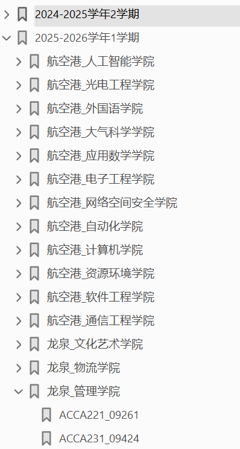

# 成都信息工程大学课程表2025版V1.1

> “工欲善其事，必先利其器”。了解专业课程，不论是转专业还是提前规划，这都是应该快人一步的

该文件由**学生数学建模协会**（数学建模好啊）龙泉前会长阿发学姐制作，使用网络爬虫从`cuit`教务处官网【公共服务】-【公共课表查询】中爬取，仅供参考。你可以通过该文件，了解某些专业会学习什么课程，目的是给新生提前了解自己专业与可能想要转入的专业所用。同时，你也可以通过学院官网（例如浏览器搜索“成都信息工程大学管理学院”）或学长学姐（兼听则明）了解更多。

课表中红色底色是产生冲突的课程，后续教务处会进行的，因此该文件仅供参考。（为什么有两种样式，因为睡一觉起来代码就出`bug`了...）课程列表中的课程不一定都会出现在课表中，例如“劳动教育实践”，因为该课程不会去教室。（每个学院应该都不一样，咱当时去乒乓球场边边上种油菜的。）

该文件主要爬取的的是**2024-2025学年2学期**与**2025-2026学年1学期**的课程表，按照学院进行分级，你可以通过`pdf`的书签快速跳转：

一般来说，某个专业可能会有多个班级，例如（已经被取消的）`会展201`、`会展202`，指的是会展经济与管理专业`20`级`1`班与`2`班。通常同一个专业学习课程相同（个别专业自选的专业选修课可能会不同），若专业较小会在一起上课，若专业较大可能会部分课程分开授课。为了保证资料体系的完整性，该文件并未在每一个专业层面对班级进行去重。

你可以通过快捷键`ctrl+F`打开搜索框进行搜索，也可以在通过书签快速跳转。

本项目基于`MIT`协议开源，您可以自由使用、修改、复制、分发，甚至用于商业用途，但必须保留原作者署名及许可声明。项目开源你自己找找，后续更新等我明年跑代码。

版本迭代：

- V1.1 [20250807-20250807]：新增了目录；修改了`readme.md`；删除了夹带的私货。
- v1.0 [20250727-20250728]：终于有了这个东西。

~~碎碎念：唉，凌晨~~

