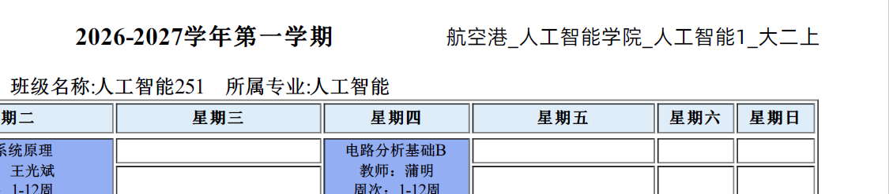
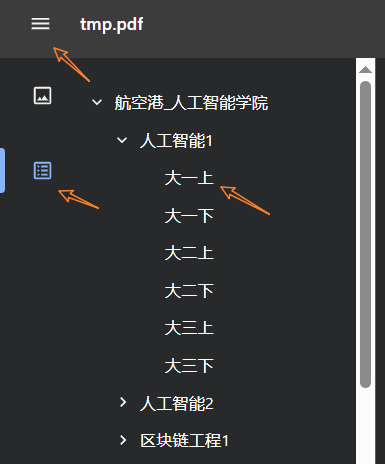
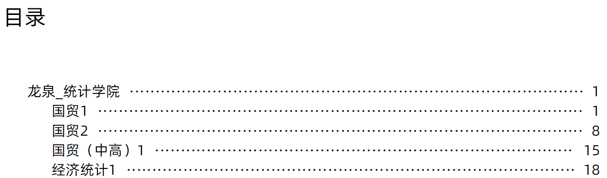
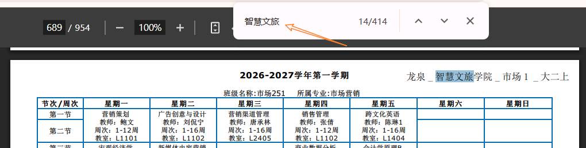

# 成都信息工程大学课程表2026版v2026.1.0_正式版

> “工欲善其事，必先利其器”。了解专业课程，不论是转专业还是提前规划，这都是应该快人一步的

## 当前版本

### 版本信息

- 适用年份：2026年
- 适用学年：第一学年
- 版本号：`v2026.1.0` [2026年第一学年正式版]

版本号说明：

一年发布两个版本，分第一学年与第二学年

对于第一学年，即上册还没有开始的那个暑假

- 在6月初7月底发布先行版（高考结束后），此时新学期的课表还未排出来，因此作为先行版发布，版本号为`year.1.0-alpha`
- 在8月上旬，即新学期课表排出来了，发布正式版，版本号为`year.1.0`

对于第二学年，即下册还没有开始的那个寒假

- 当课表排出来了，发布一个正式版，版本号为`year.2.0`

特别的，如有必要，例如代码出现bug或课表发生大改，会发布修复版，版本号为`year.y.z-fix`，其中`z`从`1`开始自增

### 版本说明

- 优化 文件整体目录结构，废弃之前的按照学年进行的目录分级，改为按照专业进行分级，提供更好的用户体验
- 新增 右上角每一个课程表具体对应的年级，提供更好的用户体验
- 新增 版本号与发布流程的规范
- 优化 页面宽度保持一致，提供更好的用户体验
- 优化 书签显示方式。将全部展开改为只展开到学院，提供更好的用户体验

## 项目介绍

### 概述

该文件由龙泉校区管理学院（现在的智慧文旅学院）会展经济与管理专业`20`级的笨阿发同学制作，使用网络爬虫从`cuit`教务处官网【公共服务】-【公共课表查询】中爬取，仅供参考。你可以通过该文件，了解某些专业会学习什么课程。目的是给新生提前了解自己专业与可能想要转入的专业所用。同时，你也可以通过学院官网（例如浏览器搜索“成都信息工程大学管理学院”）或学长学姐（兼听则明）了解更多。

特别的，如果你已经分配到了教务处账号，建议使用教务处的网站以获取最新的精确的课程信息。本文件只是单纯填补想要卷一卷的新生在分配教务处账号之前的空白期。

课表中红色底色是产生冲突的课程，后续教务处会进行的，因此该文件仅供参考。课程列表中的课程不一定都会出现在课表中，例如“劳动教育实践”，因为该课程不会去教室。（每个学院应该都不一样，咱当时去乒乓球场边边上种油菜的。）

### 关于年级

一般来说，某个专业可能会有多个班级，例如（已经被取消的）`会展201`、`会展202`，指的是会展经济与管理专业`20`级，即`2020`年入学的`1`班与`2`班。通常同一个专业学习课程相同（个别专业自选的专业选修课可能会不同），若专业较小会在一起上课，若专业较大可能会部分课程分开授课。为了保证资料体系的完整性，该文件并未在每一个专业层面对班级进行去重。

由于当前年份的新生部分学期尚未产生正式课程表，因此对于未来学期，会使用往届相同阶段学生的课程表作为参考。例如：

- 2026 级新生在 2026 年秋季入学，目前只能获得大一上课程数据；
- 大一下以及后续学期的课程安排，会参考 2025 级及更早年份学生的课程表。

课程表中的“大一上、大一下、大二上……”表示学生入学后的培养阶段，不代表课程表发布年份。

以2026级新生课程为例：

| 学生阶段 | 数据来源       |
| -------- | -------------- |
| 大一上   | 2026级第一学期 |
| 大一下   | 2025级第二学期 |
| 大二上   | 2025级第一学期 |
| 大二下   | 2024级第二学期 |
| 大三上   | 2024级第一学期 |
| 大三下   | 2023级第二学期 |
| 大四上   | 2023级第一学期 |
| 大四下   | 2022级第二学期 |

特别的，并不是每一届都是有相同的专业。例如`软工（中外合作）261`在2026年开设，那么就没有之前的课表，此时可以（在询问学长学姐后）参考相近专业的课表。同时并不是每一届都是有相同数量的班，例如这位同学发现自己是`经济统计263`，但是`23-25`却只有`经济统计2x1`与`经济统计2x2`，那么可以参考有的班的课程表。（这个例子我瞎编的...）。同时，也并不是所有专业4年都有课程表，可能大四下没有这个课程，或这个专业已经被取消了，或者在大二会开始分方向。

按照这个规则，我在每一个课程表右上角都新增了具体对应的年级信息，方便食用。

<div align="center">

</div>

值得注意的是，有些课程代码我也不懂是什么，例如`网络232-Z_09737`，反正代码兼容不报错就可以了，可以具体询问对应专业的学长学姐。

### 使用方法

该文件主要爬取的的是**2025-2026学年2学期**与**2026-2027学年1学期**的课程表，按照学院与专业进行分级。强烈建议使用电脑打开。

- 你可通过`pdf`的书签快速跳转

<div align="center">

</div>

- 也可点击目录进行跳转

<div align="center">

</div>
- 也可通过快捷键`ctrl+F`打开搜索框进行搜索

<div align="center">

</div>

### 特别地

项目开源`cuit-course-schedule`，更新可等我跑代码，或自己找一下。

特别感谢：`Linux_Miga`同学提供的教务处账号。

## 开源协议

本项目基于`MIT`协议开源，您可以自由使用、修改、复制、分发，甚至用于商业用途，但必须保留原作者署名及许可声明。

```
Copyright (C) <2026> <笨阿发>

Permission is hereby granted, free of charge, to any person obtaining a copy of this software and associated documentation files (the "Software"), to deal in the Software without restriction, including without limitation the rights to use, copy, modify, merge, publish, distribute, sublicense, and/or sell copies of the Software, and to permit persons to whom the Software is furnished to do so, subject to the following conditions:

The above copyright notice and this permission notice shall be included in all copies or substantial portions of the Software.

THE SOFTWARE IS PROVIDED "AS IS", WITHOUT WARRANTY OF ANY KIND, EXPRESS OR IMPLIED, INCLUDING BUT NOT LIMITED TO THE WARRANTIES OF MERCHANTABILITY, FITNESS FOR A PARTICULAR PURPOSE AND NONINFRINGEMENT. IN NO EVENT SHALL THE AUTHORS OR COPYRIGHT HOLDERS BE LIABLE FOR ANY CLAIM, DAMAGES OR OTHER LIABILITY, WHETHER IN AN ACTION OF CONTRACT, TORT OR OTHERWISE, ARISING FROM, OUT OF OR IN CONNECTION WITH THE SOFTWARE OR THE USE OR OTHER DEALINGS IN THE SOFTWARE.
```

```
版权 (C) <2026> <笨阿发>

特此免费授权任何获得本软件及相关文档文件（以下简称“软件”）副本的人士，无限制地处理该软件，包括但不限于使用、复制、修改、合并、发布、分发、再许可和/或出售软件副本的权利，并允许软件提供对象进行上述操作，但须遵守以下条件：

上述版权声明及本许可声明应包含在软件的所有副本或实质性部分中。

本软件按“原样”提供，不提供任何形式的明示或暗示保证，包括但不限于对适销性、特定用途的适用性及不侵权的保证。在任何情况下，作者或版权持有者均不对因本软件、本软件的使用或与本软件相关的任何索赔、损害赔偿或其他责任承担责任，无论该索赔、损害赔偿或其他责任是基于合同、侵权或其他原因。
```

## 历史版本

### 2026

- 成信大课程表2026版V2026.01_先行版.pdf
  - 更新 `2026`年课程表
  - 新增 课程表页面清洗步骤 去除课程表页面顶部与尾部的无意义的部分
  - 新增 `ChatGPT Images 2.0`生成的封面

### 2025

- 成信大课程表2025版V1.1.pdf
  - 新增 目录
  - 修复`readme.md`文件
  - 删除 夹带的私货
- 成信大课程表2025版V1.0.pdf
  - 终于有了这个东西
