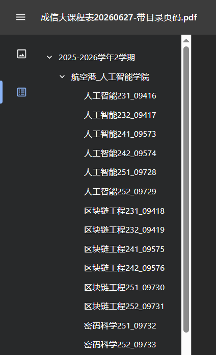
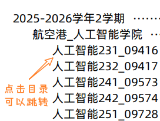

# 成都信息工程大学课程表2026版V2026.01_先行版

> 做完了才发现，新生课表没有出，因此发布先行版，预计在7月中下旬发布完整版。可以在`成信大课程表2025版V1.1.pdf`参考去年的新生课程表。
>
> “工欲善其事，必先利其器”。了解专业课程，不论是转专业还是提前规划，这都是应该快人一步的

该文件由龙泉校区管理学院会展经济与管理专业`20`级的笨阿发同学制作，使用网络爬虫从`cuit`教务处官网【公共服务】-【公共课表查询】中爬取，仅供参考。你可以通过该文件，了解某些专业会学习什么课程。目的是给新生提前了解自己专业与可能想要转入的专业所用。同时，你也可以通过学院官网（例如浏览器搜索“成都信息工程大学管理学院”）或学长学姐（兼听则明）了解更多。

课表中红色底色是产生冲突的课程，后续教务处会进行的，因此该文件仅供参考。课程列表中的课程不一定都会出现在课表中，例如“劳动教育实践”，因为该课程不会去教室。（每个学院应该都不一样，咱当时去乒乓球场边边上种油菜的。）

该文件主要爬取的的是**2025-2026学年2学期**与**2026-2027学年1学期**的课程表，按照学院进行分级。强烈建议使用电脑打开。

- 你可通过`pdf`的书签快速跳转

- 也可点击目录进行跳转

- 也可通过快捷键`ctrl+F`打开搜索框进行搜索

一般来说，某个专业可能会有多个班级，例如（已经被取消的）`会展201`、`会展202`，指的是会展经济与管理专业`20`级`1`班与`2`班。通常同一个专业学习课程相同（个别专业自选的专业选修课可能会不同），若专业较小会在一起上课，若专业较大可能会部分课程分开授课。为了保证资料体系的完整性，该文件并未在每一个专业层面对班级进行去重。

本项目基于`MIT`协议开源，您可以自由使用、修改、复制、分发，甚至用于商业用途，但必须保留原作者署名及许可声明。项目开源`cuit-course-schedule`，更新可等我跑代码，或自己找一下。

特别感谢：`Linux_Miga`同学提供的教务处账号。

版本迭代：

- V2026.01 [20260628-20260628]：更新`2026`年课程表；去除课程表页面顶部与尾部的无意义的部分；使用`ChatGPT Images 2.0`生成封面。
- V1.1 [20250807-20250807]：新增了目录；修改了`readme.md`；删除了夹带的私货。
- v1.0 [20250727-20250728]：终于有了这个东西。

